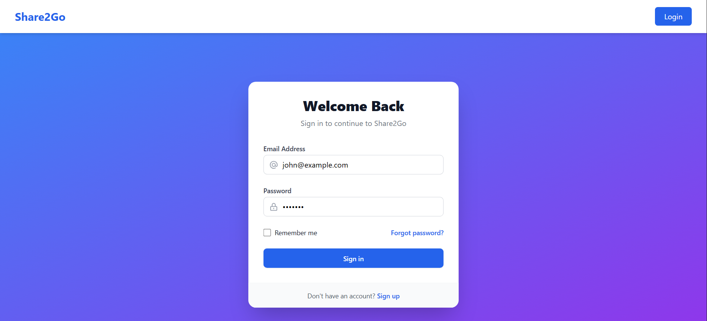
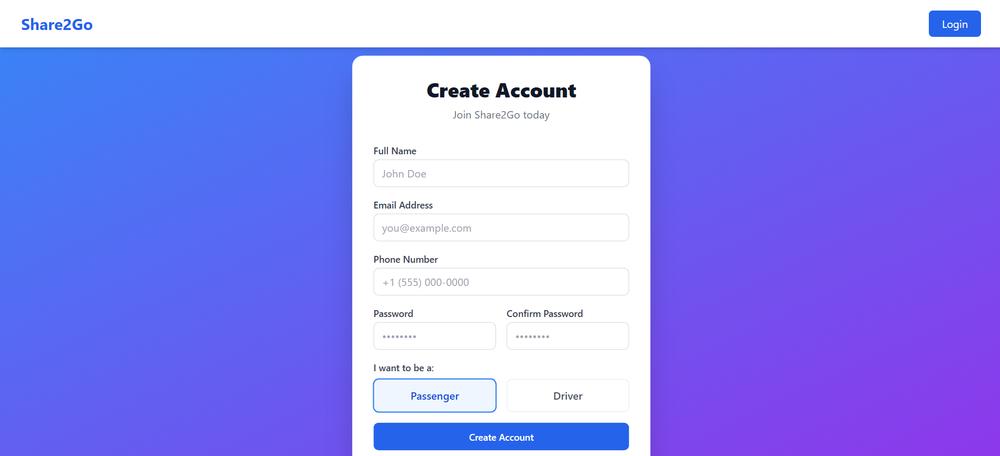
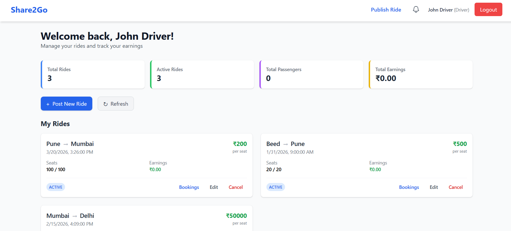
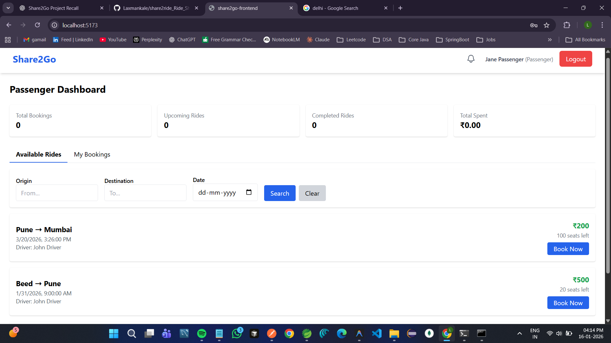
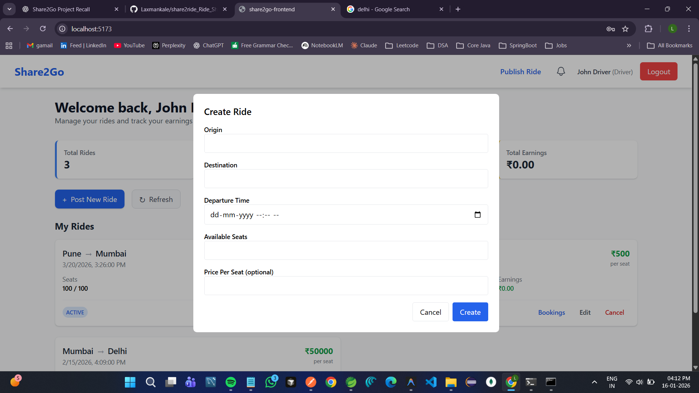
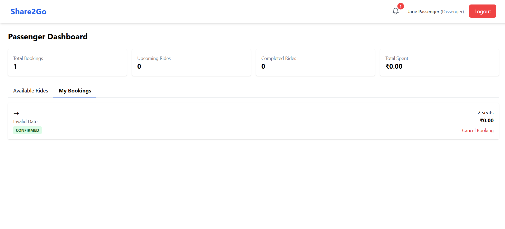

# 🚗 Share2Go - Ride Sharing Application

A full-stack ride-sharing platform connecting drivers and passengers for convenient carpooling. Built with Spring Boot and React.

## ✨ Features

- **For Drivers**: Publish rides, manage bookings, track earnings
- **For Passengers**: Search rides, book seats, track bookings
- **Security**: JWT authentication with role-based access (Driver/Passenger)
- **Real-time Updates**: Dynamic dashboard with booking notifications

## 🛠 Tech Stack

**Backend**: Spring Boot 3.5.3 • Java 17 • MySQL • Spring Security • JWT  
**Frontend**: React 19 • Vite • Tailwind CSS • Axios • React Router

## 🚀 Quick Start

### Prerequisites
- Java 17+, Node.js 16+, MySQL 8.0+, Maven 3.6+

### 1. Database Setup
```sql
CREATE DATABASE share2go_app;
```

### 2. Backend Setup
```bash
cd share2go-backend
# Edit src/main/resources/application.properties with your MySQL credentials
./mvnw spring-boot:run
```
Backend runs on **http://localhost:8080**

### 3. Frontend Setup
```bash
cd share2go-frontend
# Create .env file: VITE_API_BASE_URL=http://localhost:8080/api
npm install
npm run dev
```
Frontend runs on **http://localhost:5173**

## 📡 Key API Endpoints

### Authentication
- `POST /api/auth/register` - Register user
- `POST /api/auth/login` - Login user

### Rides
- `POST /api/rides` - Publish ride (Driver)
- `GET /api/rides/search?source=X&destination=Y&date=Z` - Search rides
- `GET /api/rides/driver/{driverId}` - Get driver's rides

### Bookings
- `POST /api/bookings` - Create booking (Passenger)
- `PUT /api/bookings/{id}/accept` - Accept booking (Driver)
- `PUT /api/bookings/{id}/reject` - Reject booking (Driver)

## 📁 Project Structure

```
share2go-rideBooking/
├── share2go-backend/          # Spring Boot REST API
│   ├── src/main/java/com/share2go/
│   │   ├── auth/              # JWT authentication
│   │   ├── controller/        # REST controllers
│   │   ├── entity/            # JPA entities
│   │   ├── repository/        # Data access
│   │   └── service/           # Business logic
│   └── src/main/resources/
│       └── application.properties
│
└── share2go-frontend/         # React SPA
    ├── src/
    │   ├── components/        # Reusable components
    │   ├── pages/             # Route pages
    │   ├── context/           # Auth context
    │   └── router/            # Route config
    └── package.json
```

## 🔐 Configuration

### Backend (`application.properties`)
```properties
spring.datasource.url=jdbc:mysql://localhost:3306/share2go_app
spring.datasource.username=root
spring.datasource.password=your_password
jwt.secret=your_secret_key_minimum_256_bits
```

### Frontend (`.env`)
```env
VITE_API_BASE_URL=http://localhost:8080/api
```

> ⚠️ **Security**: Change default JWT secret before production deployment!

## 📸 Screenshots

### Login Page


### Register Page


### Driver Dashboard


### Passenger Dashboard


### Publish Ride


### Booking Modal


## 👨‍💻 Author

**Laxman Kale**  
GitHub: [@Laxmankale](https://github.com/Laxmankale) • [Repository](https://github.com/Laxmankale/share2ride_Ride_Sharing_App)

---

**Made with ❤️ for the ride-sharing community**
